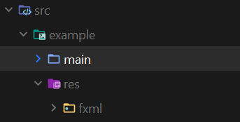
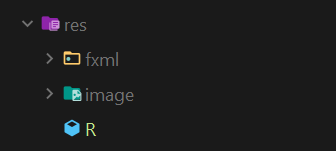
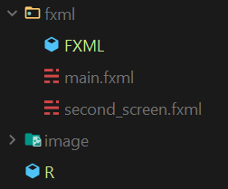

# IntentFX
Adding multiple screen in your app add a great user experience in an app. Though navigation from one screen to anther screen can achieved so easily, it is quit difficult to do the same in JavaFX.

Though there are many ways to achieve this goal in JavaFX, this project is about how to achieve screen changing(multiple scene in a single stage). IntentFX class help us to achieve this goal.


# How to use:
### *Prerequisite to use IntentFX class:*

**Step - 1: Make a res folder and make a fxml sub-folder in the src folder **



**Step-2: Main a R class in the res folder**



**Step-3: Make FXML class in fxml folder and put all your fxml file in it**



**Step-4: Create a getURLByName() method[You can give your own name]**

```java
import java.net.URL;

public class FXML {
    public URL getURLByName(String name){
        return getClass().getResource(name);
    }
}
```

**Step-5: Create a static variable in R class**

```java
public class R {
    public static final FXML fxml = new FXML();
}
```


Ok now you are ready to use IntentFX class.

### *How to use IntentFX class*:

Here I will describe the [example](src/example) that I made to describe how to use IntentFX. Please take a look at the [fxml](src/example/res/fxml) files.

**Step-1: Creating Main class**

```java
public class Main extends Application {
    public static void main(String[] args) {
        launch(args);
    }
    @Override
    public void start(Stage primaryStage) {
        try {
             //this constructor add a new scene to the stage from the fxml file
            //there will be no animation as it is the 1st screen
            IntentFX intent = new IntentFX(primaryStage,"first_screen.fxml");
            //start a brand new scene
            intent.startNewScene();
            primaryStage.show();
        } catch (IOException e) {
            e.printStackTrace();
        }
    }
}
```

**Step-2: Creating FirstScreenController**

```java
public class FirstSreenController implements Initializable {
    public static final String TAG = "FirstSreenController->";
    public Label mCounterLBL;
    public Button mPlusBtn;
    public Button mMinusBtn;
    public Button mChangeSceneBtn;

    @Override
    public void initialize(URL url, ResourceBundle resourceBundle) {
        System.out.println(TAG + " initialize()");
        bindListeners();
    }

    private void bindListeners() {
        mPlusBtn.setOnAction(event -> {
            System.out.println("plus clicked");
            updateCounter(1);
        });
        mMinusBtn.setOnAction(event -> {
            System.out.println("minus button clicked.");
            updateCounter(-1);
        });
        mChangeSceneBtn.setOnAction(event -> {
            //create a intent to add second_screen on the stage
            //look at the 3rd parameter which specify the animation while changing screen
            IntentFX intent = new IntentFX(mChangeSceneBtn,"second_screen.fxml",IntentFX.SLIDE_DOWN_TO_UP);
            try {
                intent.startNewScene();
            } catch (IOException e) {
                e.printStackTrace();
            }
        });
    }

    private void updateCounter(int change) {
        int cnt = Integer.parseInt(mCounterLBL.getText());
        cnt += change;
        mCounterLBL.setText(String.valueOf(cnt));
    }
}

```

**Step-3: Create Second Screen Controller**

```java
public class SecondScreenController implements Initializable {
    public Button mBackBtn;

    @Override
    public void initialize(URL url, ResourceBundle resourceBundle) {
        mBackBtn.setOnAction(event -> {
            try {
                //intent to add a new scene in the stage
                IntentFX intent = new IntentFX(mBackBtn,"first_screen.fxml",IntentFX.SLIDE_DOWN_TO_UP);
                //this time we use startScene() instead of startNewScene()
                //this help you to get back to the scene in it's previous state
                //that you left previously
                intent.startScene();
            } catch (IOException e) {
                e.printStackTrace();
            }
        });
    }
}
```


# Documentation:

**Constructors**:

```java
 	public IntentFX(Stage stage, String fxmlFileName) 
    public IntentFX(Stage stage, String fxmlFileName,int animation) 
        
    public IntentFX(Scene scene, String fxmlFileName) 
    public IntentFX(Scene scene, String fxmlFileName,int animation)

    public IntentFX(Node node, String fxmlFileName)
    public IntentFX(Node node, String fxmlFileName, int animation)
```
**Public methods:**

```java
	/**
     * change the scene of the stage by replacing the previous one
     * remove the previous scene if exist from SceneManager Hash
     *
     * @throws IOException if the fxml is not found in the fxml folder 
     * you must define a R class and create a fxml folder in R class location
     * then you have to create a FXML file 
     * as shown in the prerequisite in https://github.com/Hmasum18/IntentFX/blob/main/README.md
     */
    public void startNewScene() throws IOException 
        
        
    /**
     * start the previous scene if exist else start a new scene of the fxml file
     *
     * @throws IOException is the fxml file was not found
     * you must define a R class and create a fxml folder in R class location
     * then you have to create a FXML file 
     * as shown in the prerequisite in https://github.com/Hmasum18/IntentFX/blob/main/README.md
    
     */
    public void startScene() throws IOException 
        
```


#### Adding a new stage in your primary stage:

This code snippet add new scene related with the fxml.
startNewScene() method starts a brand-new scene deleting the previous scene if exist.
```java
Intent intent = new Intent(primaryStage,"first_screen.fxml");
intent.startNewScene();
primaryStage.show();
```
#### Adding a new stage in a node(button here):
This code snippet add new scene related with the fxml.
startNewScene() method starts a brand-new scene deleting the previous scene if exist.
```java
 mChangeSceneBtn.setOnAction(event -> {
            Intent intent = new Intent(mChangeSceneBtn,"second_screen.fxml");
            try {
                intent.startNewScene();
            } catch (IOException e) {
                e.printStackTrace();
            }
        });
```
#### Demonstrating startScene() method: 
startScene() method add the old scene to the stage if exist.

In scene doesn't exist creates a new scene and add it to the stage.
```java
 mBackBtn.setOnAction(event -> {
            try {
                Intent intent = new Intent(mBackBtn,"main.fxml");
                intent.startScene();
            } catch (IOException e) {
                e.printStackTrace();
            }
        });
```

#### _see [example](src/example) for further understanding_

License
--------

```
   MIT License
   
   Copyright (c) 2020 Hasan Masum
   
   Permission is hereby granted, free of charge, to any person obtaining a copy
   of this software and associated documentation files (the "Software"), to deal
   in the Software without restriction, including without limitation the rights
   to use, copy, modify, merge, publish, distribute, sublicense, and/or sell
   copies of the Software, and to permit persons to whom the Software is
   furnished to do so, subject to the following conditions:
   
   The above copyright notice and this permission notice shall be included in all
   copies or substantial portions of the Software.
   
   THE SOFTWARE IS PROVIDED "AS IS", WITHOUT WARRANTY OF ANY KIND, EXPRESS OR
   IMPLIED, INCLUDING BUT NOT LIMITED TO THE WARRANTIES OF MERCHANTABILITY,
   FITNESS FOR A PARTICULAR PURPOSE AND NONINFRINGEMENT. IN NO EVENT SHALL THE
   AUTHORS OR COPYRIGHT HOLDERS BE LIABLE FOR ANY CLAIM, DAMAGES OR OTHER
   LIABILITY, WHETHER IN AN ACTION OF CONTRACT, TORT OR OTHERWISE, ARISING FROM,
   OUT OF OR IN CONNECTION WITH THE SOFTWARE OR THE USE OR OTHER DEALINGS IN THE
   SOFTWARE.
```
